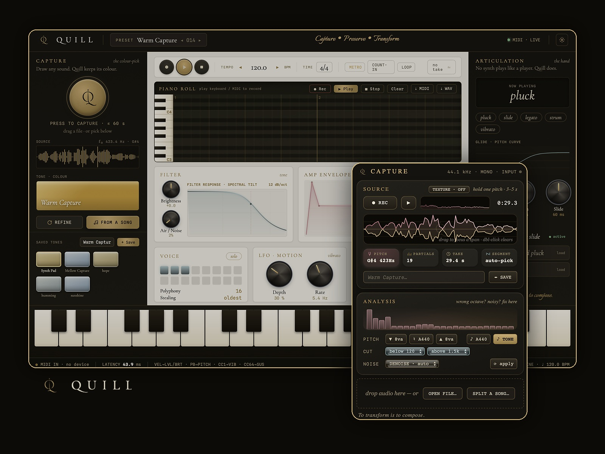

# Quill

### Record a sound. Play it as an instrument.

**▶ [Watch the demo](https://youtu.be/_brryUulZTs)**

---

Most tools that turn a recording into something you can play are really just samplers — they replay the exact clip you fed them. Quill tries to do something different: point it at a few seconds of any pitched sound — your voice, a wine glass, an instrument, a synth — and it works out the recipe behind that sound and rebuilds it, so you can actually play it on a keyboard. Any pitch, any length, and it still sounds like itself.

The part I'm most excited about is that it also picks up *how* a sound is played. Overlap two keys and it slides between them; the harder you press, the faster the slide. So you can put a guitar's phrasing on a human voice — a voice that slides like a guitar.

## What it does right now

- Capture a sound by recording it, dropping in a file, or pulling one instrument out of a whole song
- Play it across your whole keyboard, and it still sounds like itself — no chipmunk effect
- It learns how a sound is played — legato, slides, strums — from a single clip
- A built-in piano roll: record a phrase, swap the sound underneath, keep the performance
- Plain MIDI in and out, so it sits next to whatever DAW you already use
- A texture mode for unpitched sounds — rain, wind, machines

## Where it's headed

It's still early. Next up: a plug-in version, per-note expression (MPE), better neural capture, and a way to share playing styles — not just sounds. A downloadable macOS build is on the way.

---

My entry for the 2026 MIDI Innovation Awards (Category B · Software).
