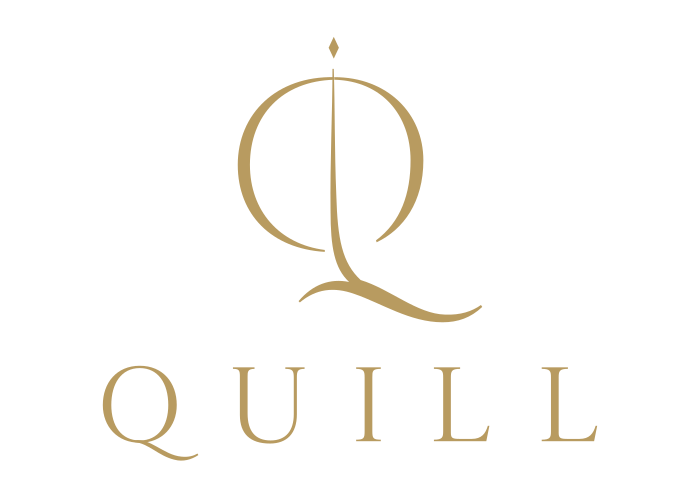

<a href="https://chuling-li-cs--quill-render-serve.modal.run/"></a>

[](https://chuling-li-cs--quill-render-serve.modal.run/) [](https://youtu.be/wJ8hX1CCM8w) [](https://ismir.net/) [](https://creativecommons.org/licenses/by-nc/4.0/)

Neural tone capture for [Audiotool](https://www.audiotool.com/). Record a few seconds of any sound. Quill extracts the timbre and the playing style as two separate assets, then re-renders your Audiotool MIDI regions in that sound, with slides, legato, and vibrato that a sampler can't do.

**Live app**: [chuling-li-cs--quill-render-serve.modal.run](https://chuling-li-cs--quill-render-serve.modal.run/) · **Demo**: [youtu.be/wJ8hX1CCM8w](https://youtu.be/wJ8hX1CCM8w)

**Category**: Creation

## Audiotool integration

Quill is a Nexus App. It connects to Audiotool through the [Nexus SDK](https://nexus.audiotool.com/) and runs entirely in the browser.

- **Reads your project live.** Log in with your Audiotool account, pick a project. Quill pulls note regions and tempo directly from the session. No MIDI export, no file upload.
- **Classifies articulations from note data.** Each note gets tagged as legato, vibrato, slide, or pluck based on overlap, pitch bend, and timing.
- **Writes back on your command.** Press Send and the rendered take goes into Audiotool: bar-aligned at the source region's position, on its own track, with a musical duration that survives tempo changes. Nothing touches your project until you choose it.
- **OAuth token stays in the browser.** The companion app handles auth client-side. No server ever sees your token.

## Two assets from one recording

A single capture produces:

- **Tone**: 60 harmonics + 40-band noise envelope + attack transient. About 50 KB. This is the texture of the sound.
- **Behavior**: vibrato curves, legato transitions, slide trajectories. This is how it was played.

They're independent. Swap the tone, keep the behavior. Your voice playing a violin part. A trumpet timbre with guitar phrasing. Mix and match.

## How to use

1. Open the app, log in with your Audiotool account.
2. Select a project with MIDI note regions.
3. Press Q, record a short pitched sound (or drag in a file).
4. Pick a behavior: your own capture, or a pre-extracted style (MIDI-DDSP distilled, cloud-glass).
5. Adjust brightness, noise, reverb, vibrato.
6. Click **INK THIS REGION**. Takes appear with inline playback.
7. Press **Send** on the one you like.

## Research

| | |
|---|---|
| Synthesis | DDSP harmonic + noise + attack, 500K params, CPU only |
| Articulation detection | 0.828 macro-F1 (IDMT-SMT-Guitar) |
| Behavior distillation | 1.74× MSE over retrieval baseline (MIDI-DDSP teacher) |
| MIDI dialect | Auto-detects keyswitch, multichannel, breath, mono-lead |

Also the demo system for our ISMIR 2026 Late-Breaking submission.

## Architecture

```
companion/          Nexus web app (TypeScript + Vite)
  src/main.ts       Nexus SDK integration, capture/ink/send workflow
  index.html        Single-page UI

deploy/
  modal_app.py      Modal serverless deployment (CPU)

analysis/           Analysis pipeline
  segment.py        Note segmentation (Basic Pitch + onset/f0)
  articulation.py   Articulation classification (rule-tree + MERT probe)
  midi_dialect.py   MIDI dialect detection and normalization

synth/              Synthesis core (numpy, no torch)
  additive.py       Harmonic resynthesis with formant preservation
  noise.py          Stochastic noise modeling
  voice.py          Voice with ADSR, glide, vibrato LFO

runtime/
  engine.py         Block-based engine (16 voices, sample-accurate)
  gesture.py        MIDI gesture interpreter

neural/
  ddsp.py           DDSP inference
  perform.py        Behavior-driven expression control
```

## Run locally

```bash
conda create -n quill python=3.10 && conda activate quill
pip install -r requirements.txt
cd companion && npm install && npx vite dev    # frontend on localhost:5173
cd deploy && modal deploy modal_app.py         # backend on Modal
```

## Author

Chuling Li · [chuling.li.cs@gmail.com](mailto:chuling.li.cs@gmail.com)

License: [CC BY-NC 4.0](https://creativecommons.org/licenses/by-nc/4.0/)
